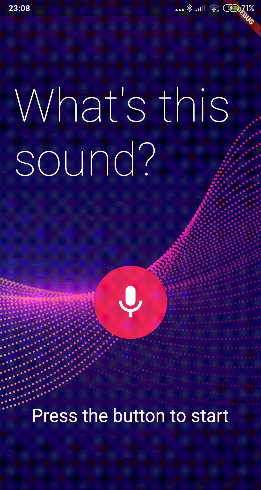

[![Medium][medium-shield]][medium-url]
[![LinkedIn][linkedin-shield]][linkedin-url]


<h1 align="center"> Sound Recognition App</h1> <br>
<p align="center">Simple Sound recognition application developed in Flutter using Tensorflow Lite framework to integrate a sound classification model</p>

<p align="center">
    
</p>


## Tecnologies

This application was developed using a cross-platform framework that allows multi-operanting systems support namely iOS and Android:

- [Flutter](https://flutter.dev) cross-platform framework 
- [Tensorflow Lite](https://www.tensorflow.org/lite) used to integrate machine learning models into mobile applications

## How to run

As a requirement, it is necessary to have Flutter already installed. To run the mobile application:

1. Get flutter dependencies:

```
flutter pub get
```

2. After mobile device connected, run the application doing:

```
flutter run
```

This [article]explores not only how this app was developed but also how to prepare both environments (Android and iOS) for the Tensorflow Lite.

## Authors
<a href="https://github.com/techprof/SoundRecognitionTensorFlutter/upload">
  </a>
